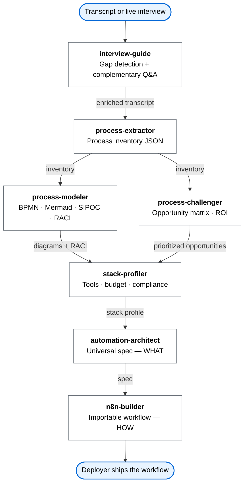
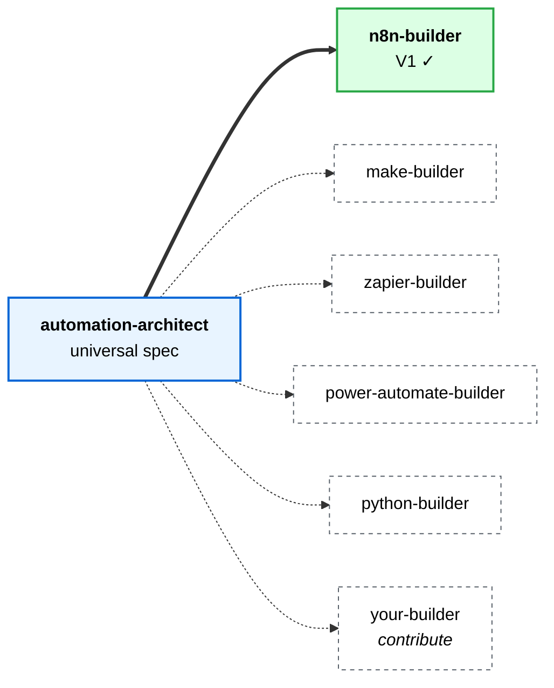

<div align="center">

# Talk2Flow

**Turn talk into deployable workflows.**

From a meeting transcript to an automation spec your developer can deploy — without consultants, without code.

[](LICENSE)
[](#pipeline-status)
[](https://claude.ai)

</div>

---

## The problem

Most automation projects fail before they start. A business owner knows their work is repetitive. A consultant interviews them. Notes get lost. The eventual solution doesn't fit the client's actual tools, budget, or skills. Nobody deploys it.

**Talk2Flow fixes the front half of that loop.**

You — or your client — describe a daily routine out loud. Talk2Flow reads the transcript, asks targeted follow-up questions to fill gaps, extracts the underlying processes, maps the existing stack, identifies optimization opportunities, and produces an automation spec adapted to what the business actually has and can run. A developer (or capable freelancer) takes that spec to production.

The last technical mile still needs a human. Talk2Flow makes that mile short.

---

## How it works



Every skill is a Claude skill — a structured prompt with a clear contract, runnable in Claude.ai today. The pipeline can be run end-to-end or one stage at a time.

**New in V1**: when you paste a transcript, Talk2Flow automatically scans it for coverage gaps (missing volumes, unnamed tools, vague pain points) and asks targeted complementary questions *before* extracting — making the output dramatically more accurate.

---

## Why it's different

| | Generic automation builders | Workflow templates | Talk2Flow |
|---|---|---|---|
| Starts from your actual words | ❌ | ❌ | ✅ |
| Asks follow-up questions to fill gaps | ❌ | ❌ | ✅ |
| Maps your real existing stack | ❌ | partial | ✅ |
| Adapts to your budget + skills | ❌ | ❌ | ✅ |
| Produces a deployable artifact | ✅ | ✅ | ✅ |
| Explicit handoff doc for your developer | ❌ | ❌ | ✅ |

Talk2Flow doesn't compete with n8n, Make, or Zapier. It produces the spec that **feeds into them**.

---

## Who it's for

Three roles around any Talk2Flow project:

- **End user** — the person whose daily work is being automated
- **Operator** — the person using Talk2Flow (the end user themselves, or a consultant interviewing them)
- **Deployer** — the developer or technical freelancer who ships the final automation to production

The framework adapts based on who is operating it. See [docs/roles-and-vocabulary.md](docs/roles-and-vocabulary.md).

---

## Pipeline status

### ✅ Available now

| Skill | What it does |
|---|---|
| `interview-guide` | Guided interview (Mode 1) or transcript review with gap detection + follow-up Q&A (Mode 2) |
| `process-extractor` | Transcript → structured process inventory (JSON). Multilingual. |
| `process-modeler` | Inventory → BPMN, inline Mermaid, SIPOC, RACI, interactive BPMN viewer |
| `process-challenger` | Inventory → effort/impact opportunity matrix, ROI estimates, dependency map |
| `stack-profiler` | Guided interview → stack profile (tools, budget, compliance, deployment context) |
| `automation-architect` | Opportunity + stack profile → builder-agnostic technical spec |

### 🔨 In progress

| Skill | Status |
|---|---|
| `n8n-builder` | Implemented — full test on a real scenario pending |

### 🔜 Roadmap



No forced migrations: if the end user already has Zapier, they get Zapier output.

**After V1:**
- `make-builder` — Make.com blueprints
- `zapier-builder` — Zaps export
- `power-automate-builder` — Microsoft Power Automate flows
- `python-builder` — Python/Node scripts with deployment instructions
- `deployment-coach` — checklists, monitoring, rollback plan

---

## Getting started

### Option 1 — Claude.ai Project (recommended for consultants & non-developers)

1. Open [Claude.ai](https://claude.ai) → **Projects** → **New Project**
2. In Project Settings → **Project instructions**, paste the content of `SKILL.md` (root of this repo)
3. Optionally add individual `skills/*/SKILL.md` files as project knowledge files for deeper reference
4. Start a conversation: paste a transcript, or say "guide me through an interview"

### Option 2 — Claude Code plugin (recommended for developers)

One-line install via the Claude Code plugin marketplace:

```
/plugin marketplace add lumio18/talk2flow
/plugin install talk2flow@talk2flow
```

The seven skills auto-load and route based on what you paste or describe. Updates flow through the marketplace.

### Option 3 — Claude Code (manual clone)

```bash
git clone https://github.com/lumio18/talk2flow.git
cd talk2flow
```

Then either point Claude Code at the directory or copy `SKILL.md` into your own `.claude/commands/` folder.

### Option 4 — Individual skills

Each `skills/<skill-name>/SKILL.md` file is self-contained. Copy any skill's content into a Claude project's instructions to run that stage independently.

---

## Enhance with MCP

Talk2Flow works out of the box without any MCP. Install these to upgrade specific output stages:

| MCP | Install | What it unlocks |
|---|---|---|
| **draw.io** (`@drawio/mcp`) | `npx -y @drawio/mcp` | Process diagrams as editable `.drawio` files instead of static HTML — opens in [diagrams.net](https://app.diagrams.net) |
| **n8n** (`n8n-mcp`) | `npx -y n8n-mcp` | Live knowledge of 1,650+ n8n nodes — more accurate workflow JSON from `n8n-builder` |
| **Notion** (hosted) | `mcp.notion.com/mcp` | Push process inventory, opportunity matrix, and specs directly to Notion databases |
| **GitHub** (`@modelcontextprotocol/server-github`) | npm package | Push deployer handoff artifacts to a GitHub repo branch |

See [docs/mcp-integrations.md](docs/mcp-integrations.md) for setup instructions and per-skill behavior details.

---

## Repository structure

```
talk2flow/
├── skills/                    one folder per skill (SKILL.md + references/)
│   ├── interview-guide/
│   ├── process-extractor/
│   ├── process-modeler/
│   ├── process-challenger/
│   ├── stack-profiler/
│   ├── automation-architect/
│   └── n8n-builder/
├── templates/                 reusable HTML/Markdown templates (BPMN viewer, etc.)
├── demos/                     end-to-end scenarios with all artifacts
│   └── pme-order-management/  reference-quality V1 flagship
├── docs/                      architecture · conventions · vocabulary
├── SKILL.md                   root skill — Talk2Flow entry point for Claude projects
├── README.md                  this file
├── PROJECT.md                 internal working document (decisions, session journal)
├── CONTRIBUTING.md            how to help
└── LICENSE                    MIT
```

---

## Demo scenarios

### PME Order Management — reference quality
Located in `demos/pme-order-management/`. A complete run of the full pipeline on a small artisanal e-commerce founder automating email order processing. All artifacts present: transcript, gap-question round, process inventory, opportunity matrix with ROI, stack profile, universal automation spec, importable n8n workflow, end-user guide, and deployer handoff.

---

## Contributing

Talk2Flow is open source from day one. Issues, PRs, and skill contributions welcome.

See [CONTRIBUTING.md](CONTRIBUTING.md) for ground rules and conventions.

Want to add a builder for a new platform? See [docs/architecture.md](docs/architecture.md) for the builder plugin contract.

---

## License

MIT — see [LICENSE](LICENSE).

You can use Talk2Flow commercially, fork it, embed it, modify it. Attribution required.
