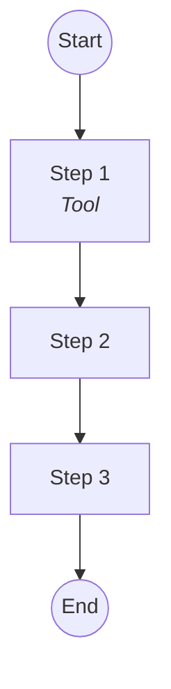
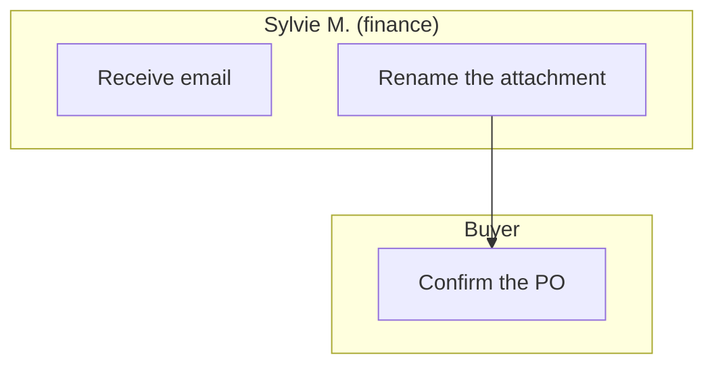
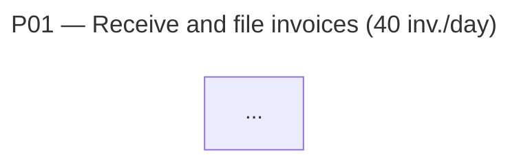
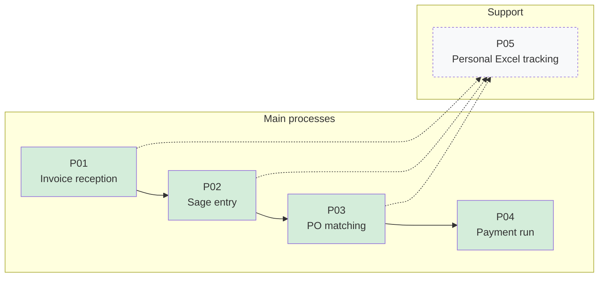
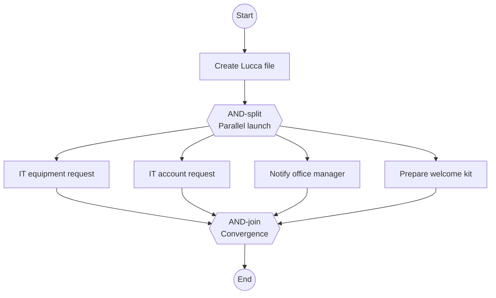
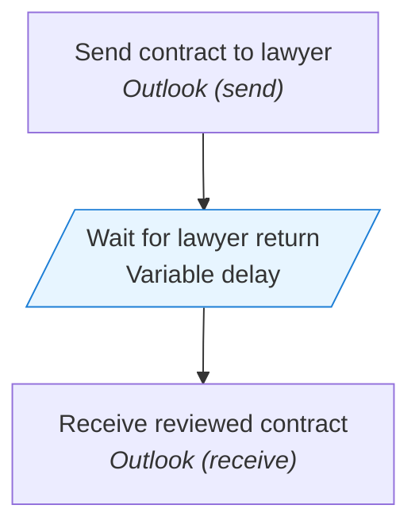

# Mermaid Guide for process-modeler

Patterns to apply for clear Mermaid diagrams, syntactically valid, and carrying the nuances of the pivot JSON (inferences, vague areas, exceptions).

## Base skeleton



- `flowchart TD` (top-down) by default
- `flowchart LR` (left-right) if more than 8 steps — more readable horizontally
- Always an explicit `start((...))` and `finish((...))` — they correspond to the trigger and the final output

## ID conventions

- IDs prefixed with the process: `P01_E1`, `P01_E2`, `P01_G1` (gateway), `P01_start`, `P01_end`
- Avoid ID conflicts between processes when concatenating them later

## Steps (rectangles)

```mermaid
P01_E1["Enter the VAT number<br/><i>Sage</i>"]
```

- Action text in plain language (not `T1` but the action verb)
- Tool used in italics on a separate line via `<br/>`
- If no tool, just the action

## Decisions (diamonds)

To use when the JSON contains:
- A **conditional business rule** (e.g., "above 5000€ → CFO")
- An **exception** with documented alternative branch
- A **step that replays** based on a condition

```mermaid
P02_G1{"New supplier?"}
P02_G1 -->|Yes| P02_E2_alt["Create supplier file"]
P02_G1 -->|No| P02_E3["Enter the invoice"]
```

If an exception is documented but without clear branch in the JSON → diamond + `[undocumented]` branch with specific style:

```mermaid
P02_G1 -->|Exceptional case| P02_unknown["[Undocumented]"]
style P02_unknown fill:#ffe5e5,stroke:#cc0000
```

## Actors in swimlanes

As soon as the process has **more than 2 distinct actors**, use subgraphs:



For 1-2 actors, no swimlanes needed (keeps the diagram lighter).

## Visual marking of inferences and vague areas

### Inferred step (`inferred: true`)

```mermaid
P01_E3["Inferred step"]
style P01_E3 stroke-dasharray: 5 5
```

The dashed outline indicates: "this step wasn't explicitly described but is probably present."

### Vague step (`description_vague: true`)

```mermaid
P01_E3["Vague step<br/><i>?</i>"]
style P01_E3 fill:#fff3cd
```

The light yellow fill indicates: "this step was mentioned but skipped over."

### Combining both

```mermaid
style P01_E3 stroke-dasharray: 5 5,fill:#fff3cd
```

## Special annotations

### Duration shown if known

If `duration_minutes` is present and significant (>5 min), show in brackets:

```mermaid
P01_E1["Rename 40 attachments<br/><i>Outlook</i><br/>[60 min]"]
```

### Volume if relevant at process level

Not in steps — in the diagram title:



## Step links

- Simple arrow `-->`: normal sequential flow
- Dashed arrow `-.->`: optional or lightly conditional flow
- Arrow with label `-->|Text|`: conditional transition (gateway output)
- Bold arrow `==>`: critical main flow (use sparingly, e.g., nominal path vs exception)

## Escaping and special characters

- No quotes in labels — use apostrophes or rephrase
- No parentheses in labels without `["..."]` encapsulation
- No unescaped `&` — replace with "and"
- No raw newlines — use `<br/>`
- Accented characters: supported as-is (`é`, `è`, `à`, `ñ`, etc.)

## Verify validity

Before rendering the diagram, verify:
- All IDs are unique
- All subgraphs (`subgraph`) are closed (`end`)
- All nodes referenced in arrows are defined
- No orphan nodes (defined but never linked) unless explicit case

## Global chaining view

A single diagram, `flowchart LR` format, showing processes as blocks and their links:



- Main in block with light color
- Support in block with dashed outline
- Explicit links in solid line, transversal in dashed
- Orphan processes (no identified link) in a separate "Isolated" subgraph

## Patterns for special cases

### Process with loop (replay a step)

```mermaid
P02_E5 --> P02_G1{"Validated?"}
P02_G1 -->|No| P02_E2
P02_G1 -->|Yes| P02_end
```

### Process with parallel steps (AND-split)

If the BPMN textual notation contains an AND-split, the Mermaid must materialize it visually with a clear join:



Note: use `{{...}}` (double brace) for AND-gateways to distinguish them visually from XOR (single brace `{...}`).

### Process with external wait (send/receive)

To visualize an external wait (following a BPMN `send`), use the parallelogram `[/.../]` which visually signals the pause:



Light blue visually signals "this isn't an active action — it's a wait point, hence a potential optimization lever for the challenger".

### Subprocess

```mermaid
P02_E2[["Subprocess:<br/>P02bis Create supplier file"]]
click P02_E2 "#P02bis"
```

Double bracket `[[...]]` = call to another process modeled separately.
